<p align="center">
  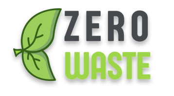
</p>

<h1 align="center">Zero Waste</h1>

<p align="center">
  A Flutter app that pays people to recycle. Drop off plastic, metal, paper or glass,
  earn points by weight, and exchange them for cash.
</p>


## How it works

1. **Sign up** and go through a 3-page onboarding.
2. **Find a bin.** "Bins Locations" on the home screen opens Google Maps.
3. **Recycle.** Show your QR code at the bin.
4. **Earn points** by material and weight (shown in the in-app *Points Info* dialog):

   | Material | Rate               |
   | -------- | ------------------ |
   | Plastic  | 300 g = 50 points  |
   | Metal    | 100 g = 50 points  |
   | Paper    | 500 g = 50 points  |
   | Glass    | 1000 g = 50 points |

5. **Exchange points for money.** The packages are 100 points = 20 EGP, 500 = 110 EGP,
   1000 = 230 EGP and 2000 = 480 EGP. Payout goes to a debit card or a mobile wallet
   (Vodafone Cash, Etisalat, WE, Orange Money, InstaPay).
6. **Track progress** in the Statistics screen: visits, income, waste by material, and points.

## Screenshots

### Onboarding and authentication

<table>
  <tr>
    <td align="center">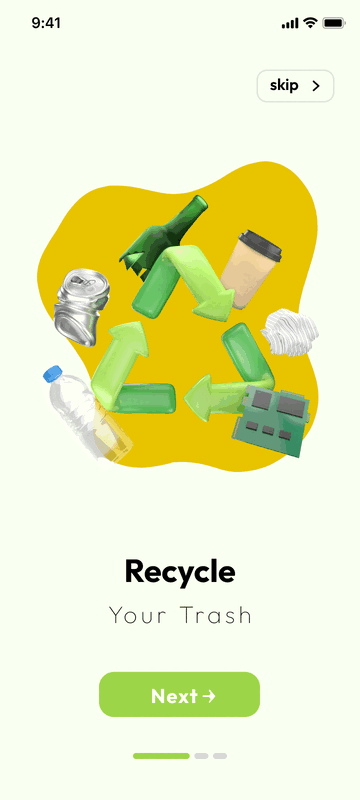<br><sub>Onboarding: recycle</sub></td>
    <td align="center">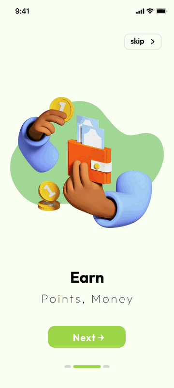<br><sub>Onboarding: earn</sub></td>
    <td align="center">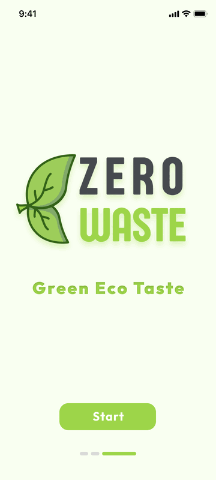<br><sub>Onboarding: start</sub></td>
    <td align="center">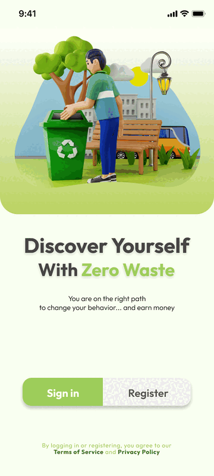<br><sub>Sign in / Register</sub></td>
    <td align="center">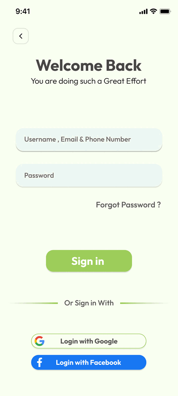<br><sub>Login</sub></td>
  </tr>
  <tr>
    <td align="center">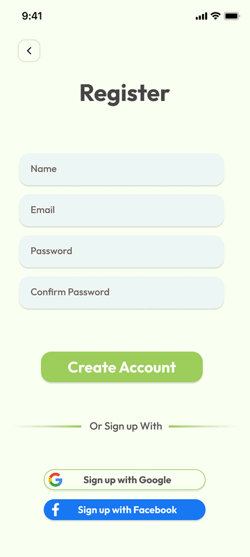<br><sub>Register</sub></td>
    <td align="center">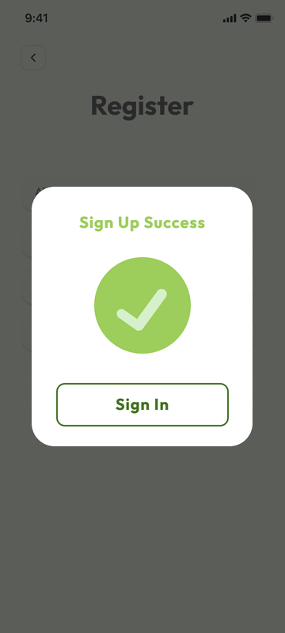<br><sub>Sign-up success</sub></td>
    <td align="center">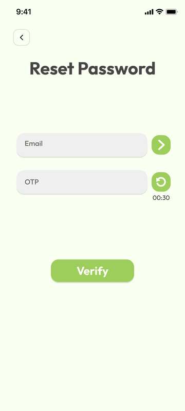<br><sub>Reset: email + OTP</sub></td>
    <td align="center">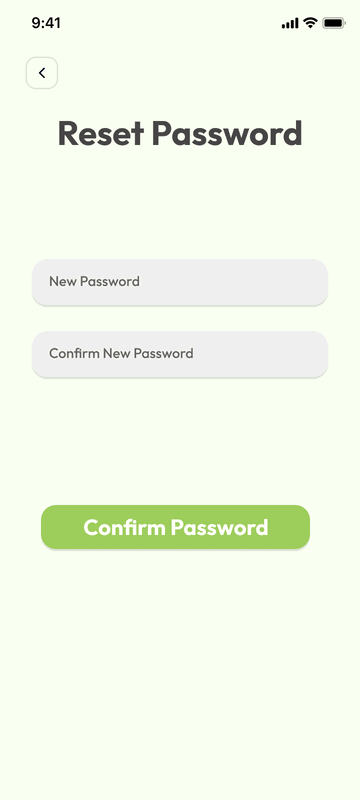<br><sub>Reset: new password</sub></td>
    <td></td>
  </tr>
</table>

### Home, bins and QR

<table>
  <tr>
    <td align="center">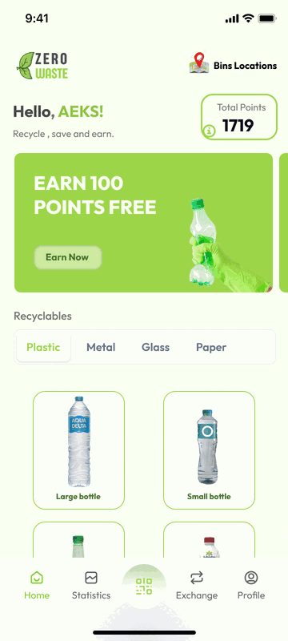<br><sub>Home: materials grid</sub></td>
    <td align="center">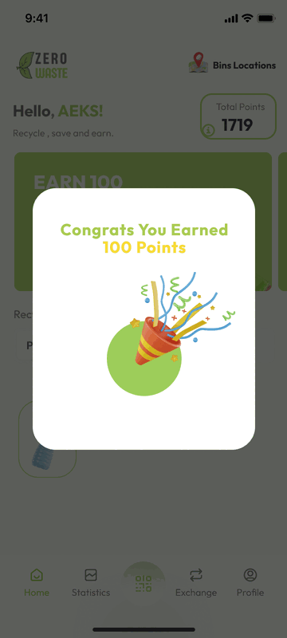<br><sub>Points earned</sub></td>
    <td align="center">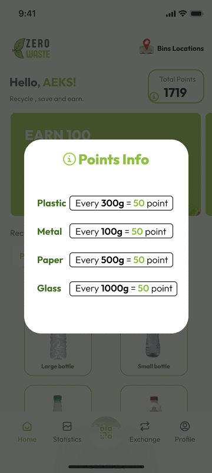<br><sub>Points rates</sub></td>
    <td align="center">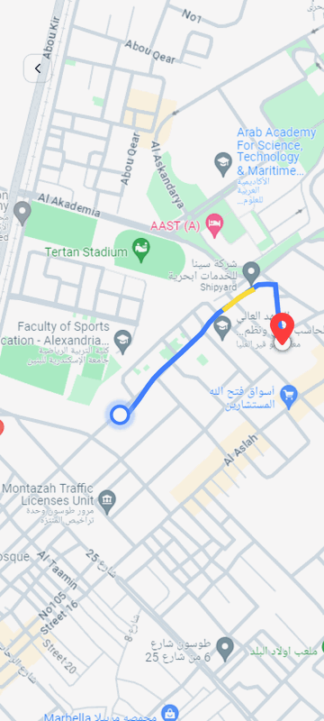<br><sub>Bins map (Google Maps)</sub></td>
    <td align="center">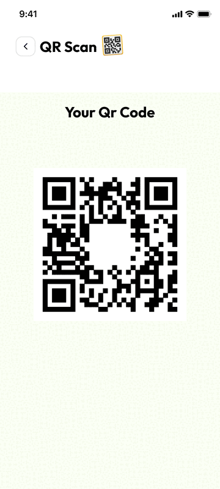<br><sub>Your QR code</sub></td>
  </tr>
</table>

### Exchange and payment

<table>
  <tr>
    <td align="center">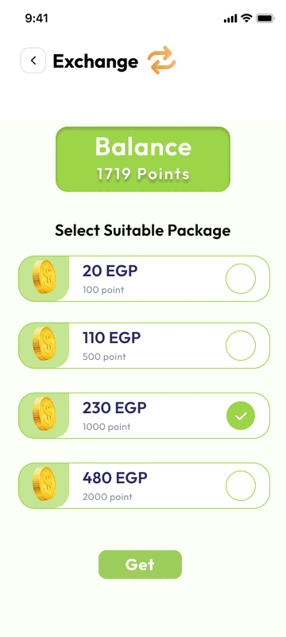<br><sub>Choose a package</sub></td>
    <td align="center">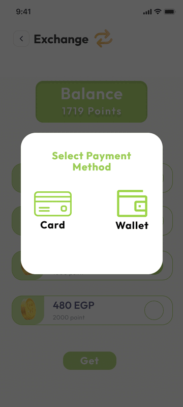<br><sub>Card or wallet</sub></td>
    <td align="center">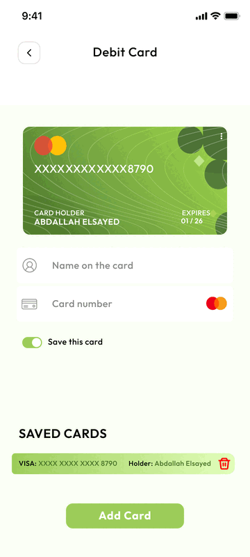<br><sub>Debit cards</sub></td>
    <td align="center">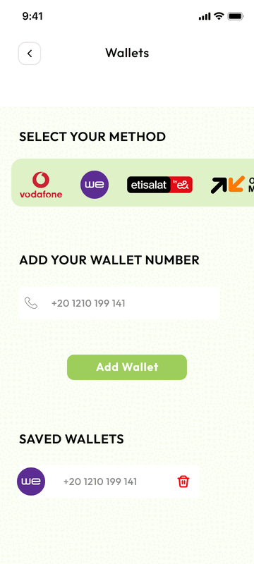<br><sub>Mobile wallets</sub></td>
  </tr>
  <tr>
    <td align="center">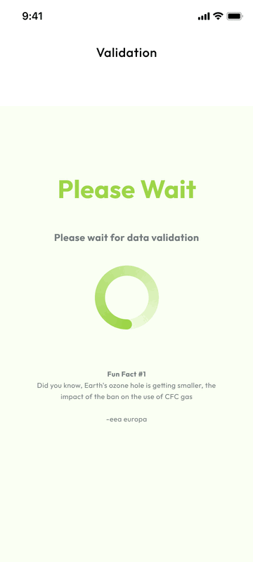<br><sub>Validating</sub></td>
    <td align="center">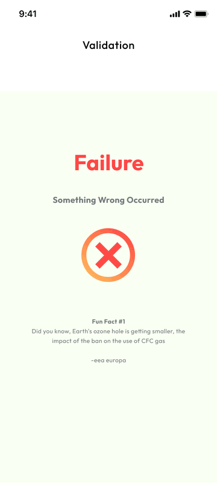<br><sub>Failure</sub></td>
    <td align="center">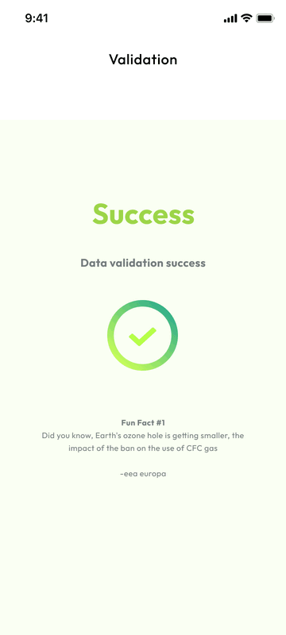<br><sub>Success</sub></td>
    <td></td>
  </tr>
</table>

### Account

<table>
  <tr>
    <td align="center">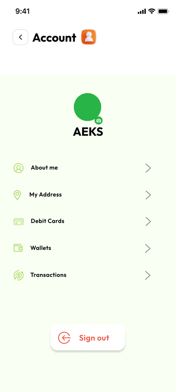<br><sub>Account menu</sub></td>
    <td align="center">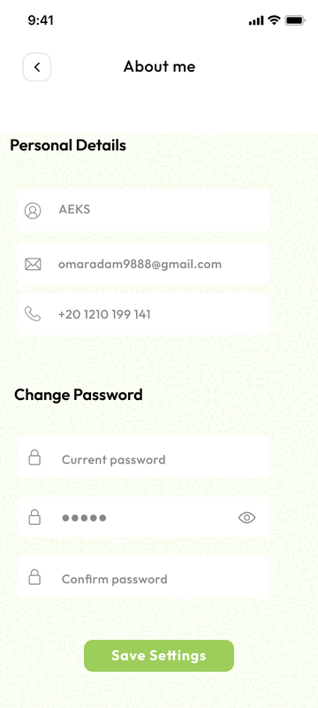<br><sub>Profile + password</sub></td>
    <td align="center">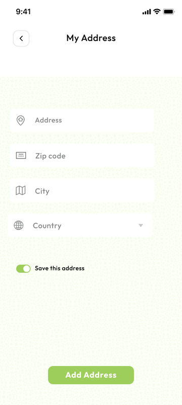<br><sub>Address</sub></td>
    <td align="center">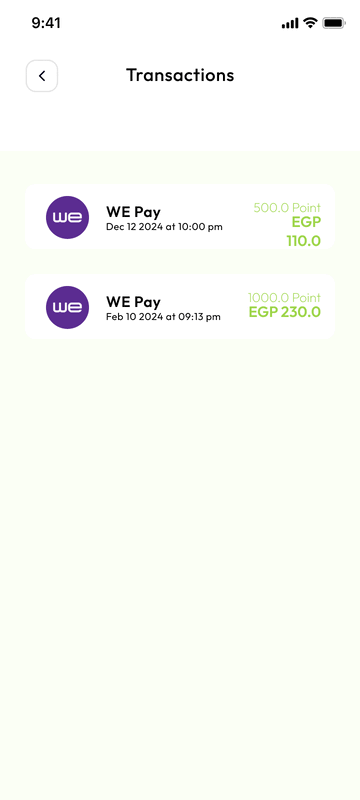<br><sub>Transactions</sub></td>
  </tr>
</table>

### Statistics

<table>
  <tr>
    <td align="center">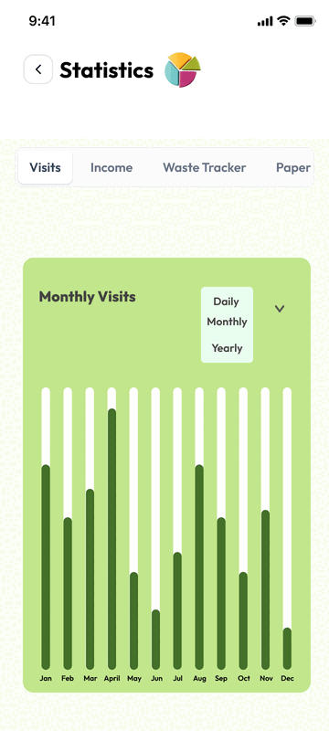<br><sub>Visits (bar)</sub></td>
    <td align="center">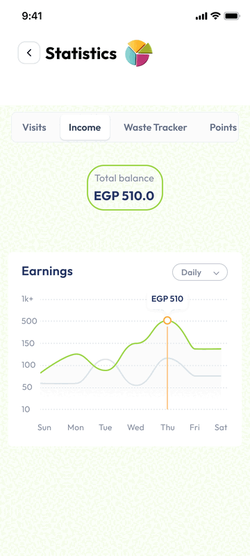<br><sub>Income (line)</sub></td>
    <td align="center">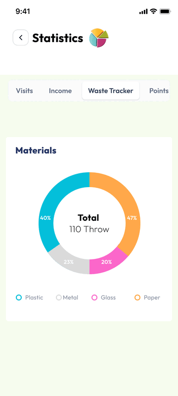<br><sub>Waste tracker (pie)</sub></td>
    <td align="center">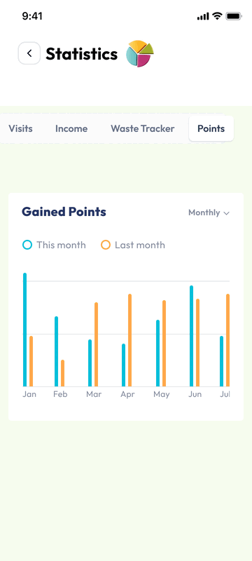<br><sub>Points, monthly</sub></td>
    <td align="center">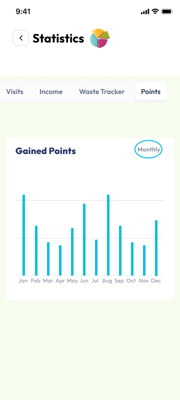<br><sub>Points, yearly</sub></td>
  </tr>
</table>


### Startup flow

[lib/main.dart](lib/main.dart) picks the first screen from local storage, then shows a splash screen:

- Onboarding flag set → onboarding
- Otherwise, no saved user token → auth screen
- Otherwise → home

## Project structure

```
lib/
├── main.dart                 App entry point and start-screen logic
├── bloc_observer.dart        Logs Bloc/Cubit state changes
├── models/                   Login, register and onboarding models
├── modules/                  One folder per feature, each with its own cubit
│   ├── authentication/       Login, register, forgot/reset password
│   ├── onboarding/
│   ├── splash_screen.dart
│   └── home/
│       ├── home_screen/      Materials grid, points, bottom nav
│       ├── qr_code/          QR display
│       ├── exchange/         Points → money packages
│       ├── statistics/       fl_chart bar, line, pie charts
│       └── account/          Profile, address, cards, wallets, transactions
└── shared/
    ├── data/local/           SharedPreferences wrapper (CacheHelper)
    ├── data/online/          Dio client (DioHelper)
    ├── themes/               Colors and text styles (Outfit font)
    ├── widgets/              Reusable buttons, fields, toasts
    └── assets.dart           Generated asset path constants
assets/
├── images/home/{plastics,metal,paper,glass}/   Item illustrations
├── images/home/profile/                        Payment logos, status art
├── icons/                                      SVG icons
└── fonts/Outfit/
docs/screenshots/             README screenshots
```

